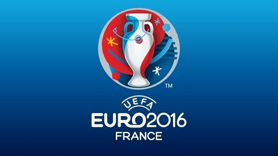

# Football Editor 16

## Задание
Редактор футбольного турнира, предназначенный для учета результатов чемпионата мира или Европы по футболу. Программа должна позволять задать список участвующих команд, редактировать результаты проведённых матчей, автоматически подводить итоги этапов турнира (подсчитывать очки, забитые и пропущенные мячи, определять занятые командами места).

## Концепция
Созданное приложение должно давать пользователю возможность вести учет футбольного соревнования, включая систему сохранения и загрузки турнира. Также, редактор должен обладать графическим интерфейсом, который позволит визуализировать заявленную функциональность и упростить общение с программой.

## Минимально работоспособный продукт
Консольное приложение, позволяющее пользователю вести учет результатов футбольного турнира: задавать список команд, выставлять результаты прошедших матчей и подводить итоги.

## Диаграмма прецедентов использования

## Диаграмма последовательностей

## Диаграмма компонентов

