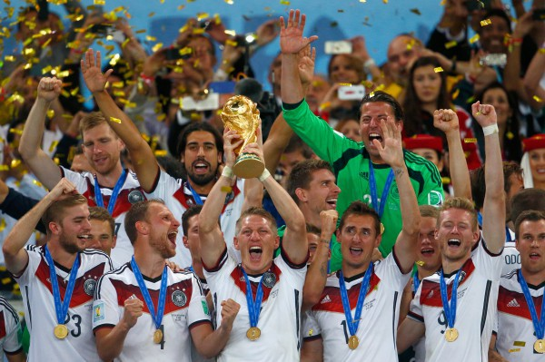
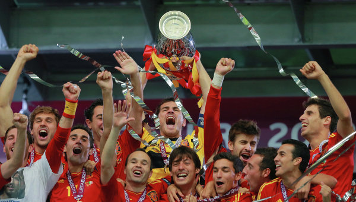

# Football Editor 16
-><-

## Задание
Редактор футбольного турнира, предназначенный для учета результатов чемпионата мира или Европы по футболу. Программа должна позволять задать список участвующих команд, редактировать результаты проведённых матчей, автоматически подводить итоги этапов турнира (подсчитывать очки, забитые и пропущенные мячи, определять занятые командами места).

## Концепция
Созданное приложение должно давать пользователю возможность вести учет футбольного соревнования, включая систему сохранения и загрузки турнира. Также, редактор должен обладать графическим интерфейсом, который позволит визуализировать заявленную функциональность и упростить общение с программой.

### Правила игры
#### Основные правила
Цель игры — забить мяч в ворота противника, сделать это как можно большее количество раз и постараться не допустить гола в свои ворота. Каждая команда состоит максимум из одиннадцати игроков (без учета запасных), один из которых должен быть вратарём. Отдельной футбольной игрой называется матч, который в свою очередь состоит из двух таймов по 45 минут и иногда дополнительного времени.

#### Определение победителя 
Победителем считается команда, забившая в течение матча большее количество голов. Если обе команды забьют одинаковое количество голов или не забьют ни одного гола, матч считается сыгранным вничью.

#### Дополнительное время в мачтах стадии плейф-офф
Дополнительное время в футбольных матчах стадии плей-офф назначается для разрешения ничьих в основное время. Это два дополнительных тайма по 15 минут и в случае ничьей пробивается серия пенальти.

### Формат проведения чемпионата мира

#### Групповой этап
На стадии группового турнира команды делятся на 8 групп по четыре команды. Состав групп определяется жеребьёвкой, во время которой 8 команд («сеяные») получают первые номера в своих группах, а остальные 24 команды разделяются на три корзины в соответствии с рейтингом сборных-участниц. В каждой группе команды проводят однокруговой турнир из трёх туров. За победу в матче команда получает 3 очка, за ничью — 1, за поражение — 0. Из каждой группы во второй раунд (плей-офф) выходят команды, занявшие первые два места, — всего 16 участников чемпионата.
#### Стадия плей-офф
Во втором раунде команды играют матчи на выбывание — проигравший (за исключением участников полуфинальных игр) заканчивает своё участие в турнире. Если счёт после окончания основного времени ничейный, назначается дополнительное время, а если и оно не помогло выявить победителя, проводится серия пенальти. В 1/8 финала победители групп первого раунда играют со вторыми командами из других групп. Победители этих игр выходят в 1/4 финала, победители 1/4 финалов — в полуфинал. Команды, проигравшие в полуфиналах, разыгрывают третье место в матче между собой. Команды, победившие в полуфиналах, играют финальный матч. Проигравший финалист награждается серебряными медалями. Победители финала получают звание чемпионов мира. 

### Формат проведения чемпионата Европы

#### Групповой этап
В 4 группах, по четыре команде в каждой, сборные играют по формату лиги, только команды играют со своими соперниками в группе по одному разу. Состав групп определяется жеребьёвкой, во время которой 4 команды («сеяные») получают первые номера в своих группах, а остальные 12 команды разделяются на три корзины в соответствии с рейтингом сборных-участниц. За победу в матче команда получает 3 очка, за ничью — 1, за поражение — 0. Из каждой группы во второй раунд (плей-офф) выходят команды, занявшие первые два места, — всего 8 участников чемпионата.
#### Стадия плей-офф
Во втором раунде команды играют матчи на выбывание — проигравший заканчивает своё участие в турнире.Если в матчах на вылет после основного времени матча счёт равный, тогда назначается дополнительное время, если оно не выявило победителя, проходит серия пенальти. Победители 1/4 финала проходят в полуфинал. Победители полуфинала играют финальный матч. Проигравшие полуфиналисты награждаются бронзовыми медалями. Проигравшая команда награждается серебряными медалями. Победитель финала становится чемпионом и награждается золотыми медалями.

## Минимально работоспособный продукт
Консольное приложение, позволяющее пользователю вести учет результатов футбольного турнира: задавать список команд, выставлять результаты прошедших матчей и подводить итоги соревнований.

## Диаграмма прецедентов использования

## Диаграмма последовательностей
ТУДУ
## Диаграмма компонентов

